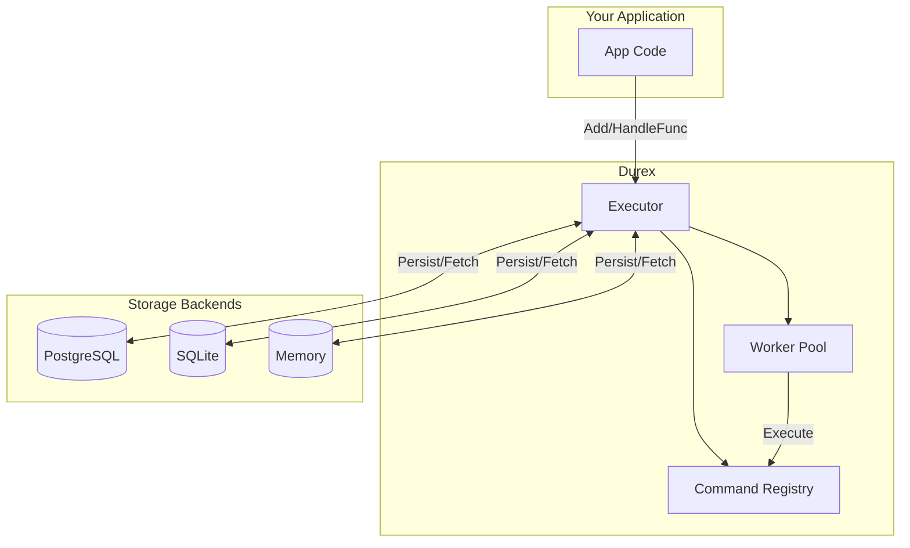
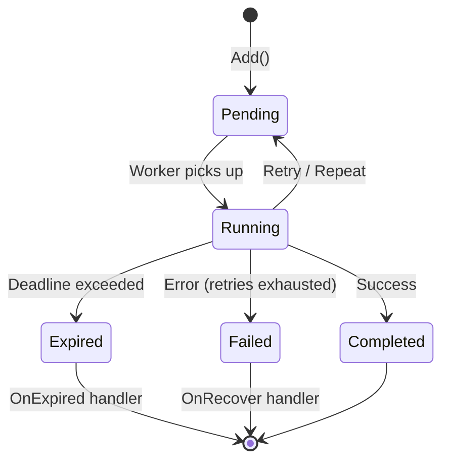
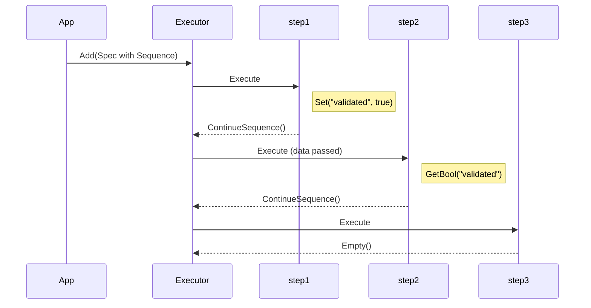
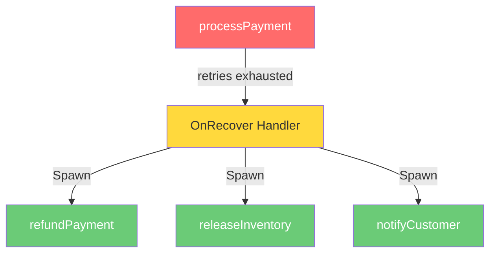

# Durex

[](https://pkg.go.dev/github.com/simonovic86/durex)
[](https://goreportcard.com/report/github.com/simonovic86/durex)
[](https://opensource.org/licenses/MIT)

**Temporal for the rest of us. Durable background jobs for Go — no Redis, no Kafka, just Go.**

Durex is a lightweight, embeddable task queue with persistence, automatic retries, workflows, and a built-in dashboard. Start with SQLite, scale with PostgreSQL.

```
┌─────────────┐     ┌─────────────┐     ┌─────────────┐
│  Your App   │────▶│   Durex     │────▶│  SQLite or  │
│             │     │  Executor   │     │  PostgreSQL │
└─────────────┘     └──────┬──────┘     └─────────────┘
                           │
              ┌────────────┼────────────┐
              ▼            ▼            ▼
         ┌────────┐   ┌────────┐   ┌────────┐
         │Worker 1│   │Worker 2│   │Worker N│
         └────────┘   └────────┘   └────────┘
```

```go
executor := durex.New(storage.NewMemory(), durex.WithDashboard(":8080"))
executor.HandleFunc("sendEmail", sendEmailHandler, durex.Retries(3))
executor.Start(ctx)

executor.Add(ctx, durex.Spec{Name: "sendEmail", Data: durex.M{"to": "user@example.com"}})
```

## Why Durex?

Most teams face a choice: simple queues (Asynq, River) that lack workflows, or Temporal which is powerful but complex. Durex gives you **80% of Temporal's features with 20% of the complexity**.

| | Durex | Asynq | River | Temporal |
|---|:---:|:---:|:---:|:---:|
| **Zero infrastructure** | ✅ SQLite/Postgres | ❌ Redis | ✅ Postgres | ❌ Server cluster |
| **Embedded dashboard** | ✅ Built-in | ❌ Separate | ❌ Separate | ✅ Built-in |
| **Cron scheduling** | ✅ | ✅ | ✅ | ✅ |
| **Workflow sequences** | ✅ | ❌ | ❌ | ✅ |
| **Fan-in (parallel + wait)** | ✅ | ❌ | ❌ | ✅ |
| **Saga pattern** | ✅ | ❌ | ❌ | ✅ |
| **Dead Letter Queue** | ✅ | ✅ | ❌ | ✅ |
| **Prometheus metrics** | ✅ | ✅ | ✅ | ✅ |
| **Multi-instance safe** | ✅ | ✅ | ✅ | ✅ |
| **Learning curve** | Low | Low | Low | High |
| **Time to first job** | 5 min | 15 min | 15 min | 1+ hour |

### Choose Durex when you need:

- **Workflows without complexity** — Sequences, sagas, fan-out/fan-in without learning a new paradigm
- **Zero infrastructure** — No Redis/Kafka to deploy; SQLite for dev, Postgres for prod
- **Embeddable library** — Ships as a Go package, not a separate service
- **Built-in observability** — Dashboard, health checks, Prometheus metrics out of the box

### When to consider alternatives:

- **Need Redis** → Use [Asynq](https://github.com/hibiken/asynq) (mature, battle-tested)
- **Already on Postgres, want simple** → Use [River](https://github.com/riverqueue/river) (newer, focused)
- **Complex long-running workflows** → Use [Temporal](https://temporal.io) (more powerful, more complex)

## Features

### Core
| Feature | Description |
|---------|-------------|
| **Persistent Jobs** | Commands survive restarts — pick up where you left off |
| **Automatic Retries** | Exponential backoff, jitter, configurable per command |
| **Cron Scheduling** | Standard cron expressions for precise scheduled execution |
| **Workflows** | Chain commands with `Sequence`, pass data between steps |
| **Fan-In Pattern** | Wait for parallel tasks with `SpawnThen` (barrier coordination) |
| **Saga Pattern** | Compensation handlers for failed workflows (`OnRecover`) |
| **Type Safety** | Generic typed handlers with `HandleTyped[T]` |

### Reliability
| Feature | Description |
|---------|-------------|
| **Multi-Instance Safe** | PostgreSQL row-level locking (`FOR UPDATE SKIP LOCKED`) |
| **Panic Recovery** | Workers survive panics, commands marked as failed |
| **Stuck Command Recovery** | Auto-detect and retry commands stuck in `STARTED` |
| **Dead Letter Queue** | Inspect and replay failed commands |
| **Execution Timeouts** | Cancel long-running handlers with context |

### Observability
| Feature | Description |
|---------|-------------|
| **Web Dashboard** | Built-in UI with retry/cancel actions |
| **CLI Tool** | Command-line management: list, stats, retry, cancel |
| **Prometheus Metrics** | Counters, histograms, gauges for all operations |
| **Health Endpoint** | `/api/health` for load balancers |
| **Tracing** | Trace and correlation IDs across command chains |

### Control
| Feature | Description |
|---------|-------------|
| **Rate Limiting** | Per-command and global concurrency limits |
| **Deduplication** | Unique keys prevent duplicate jobs |
| **Deadlines** | Time-bound execution with expiration handlers |
| **Cancellation** | Cancel by ID or tag |

## Architecture



## Installation

### Library

```bash
go get github.com/simonovic86/durex
```

### CLI Tool

```bash
# Install globally
go install github.com/simonovic86/durex/cmd/durex@latest

# Or build from source
cd cmd/durex && go build -o durex .
```

The CLI provides command-line management of durex workflows:

```bash
# List failed commands
durex list --db=/path/to/durex.db --status=failed

# Show statistics
durex stats --db=/path/to/durex.db --detailed

# Retry a failed command
durex retry cmd_abc123 --db=/path/to/durex.db

# Start dashboard
durex dashboard --db=/path/to/durex.db
```

See [CLI documentation](./cmd/durex/README.md) for full details.

## Quick Start

```go
package main

import (
    "context"
    "github.com/simonovic86/durex"
    "github.com/simonovic86/durex/storage"
)

func main() {
    // Create executor
    executor := durex.New(storage.NewMemory())

    // Register a command - just a function!
    executor.HandleFunc("greet", func(ctx context.Context, cmd *durex.Instance) (durex.Result, error) {
        name := cmd.GetString("name")
        fmt.Printf("Hello, %s!\n", name)
        return durex.Empty(), nil
    })

    // Start processing
    executor.Start(context.Background())
    defer executor.Stop()

    // Add a command
    executor.Add(ctx, durex.Spec{
        Name: "greet",
        Data: durex.M{"name": "World"},
    })
}
```

## Three Ways to Create Commands

### 1. Simple Function (Recommended)

```go
// Basic - just a function
executor.HandleFunc("sendEmail", func(ctx context.Context, cmd *durex.Instance) (durex.Result, error) {
    to := cmd.GetString("to")
    return mailer.Send(to), nil
})

// With options
executor.HandleFunc("sendEmail", sendEmailFn,
    durex.Retries(3),
    durex.OnRecover(handleFailure),
    durex.OnExpired(handleTimeout),
)
```

### 2. Typed Function (Type-Safe Data)

```go
type EmailData struct {
    To      string `json:"to"`
    Subject string `json:"subject"`
}

// No more GetString() - data is typed!
durex.HandleTyped(executor, "sendEmail", func(ctx context.Context, data EmailData, cmd *durex.Instance) (durex.Result, error) {
    return mailer.Send(data.To, data.Subject), nil
}, durex.WithRetries[EmailData](3))

// Add with typed data
executor.Add(ctx, durex.Typed("sendEmail", EmailData{
    To:      "user@example.com",
    Subject: "Welcome!",
}))
```

### 3. Struct (When You Need Dependencies)

```go
type SendEmailCommand struct {
    durex.BaseCommand
    mailer *MailService
}

func (c *SendEmailCommand) Name() string { return "sendEmail" }

func (c *SendEmailCommand) Execute(ctx context.Context, cmd *durex.Instance) (durex.Result, error) {
    return c.mailer.Send(cmd.GetString("to")), nil
}

executor.Register(&SendEmailCommand{mailer: mailerService})
```

## Command Results

| Result | Description |
|--------|-------------|
| `durex.Empty()` | Done, no follow-up |
| `durex.Repeat()` | Run again after Period |
| `durex.Retry()` | Retry immediately |
| `durex.Next(spec)` | Spawn one command |
| `durex.Spawn(specs...)` | Spawn multiple commands |

### Command Lifecycle



## Workflows (Command Chaining)



```go
// Register steps
executor.HandleFunc("step1", func(ctx context.Context, cmd *durex.Instance) (durex.Result, error) {
    cmd.Set("validated", true)  // Pass data to next step
    return cmd.ContinueSequence(nil), nil
})

executor.HandleFunc("step2", func(ctx context.Context, cmd *durex.Instance) (durex.Result, error) {
    validated := cmd.GetBool("validated")  // Receive data from previous step
    return cmd.ContinueSequence(nil), nil
})

// Execute workflow: step1 → step2 → step3
executor.Add(ctx, durex.Spec{
    Name:     "step1",
    Sequence: []string{"step2", "step3"},
    Data:     durex.M{"orderId": "123"},
})
```

### Fan-In: Wait for Parallel Tasks

Use `SpawnThen` to run tasks in parallel and wait for all to complete (barrier pattern):

```go
executor.HandleFunc("processOrder", func(ctx context.Context, cmd *durex.Instance) (durex.Result, error) {
    orderId := cmd.GetString("orderId")
    
    // Run these tasks in parallel, wait for ALL to complete
    return durex.SpawnThen(
        []durex.Spec{
            {Name: "chargePayment", Data: durex.M{"orderId": orderId}},
            {Name: "reserveInventory", Data: durex.M{"orderId": orderId}},
            {Name: "sendEmail", Data: durex.M{"orderId": orderId}},
        },
        // This runs ONLY after all 3 tasks complete successfully
        durex.Spec{Name: "shipOrder", Data: durex.M{"orderId": orderId}},
    ), nil
})

// The continuation only runs if ALL parallel tasks succeed
// If any task fails, the continuation is NOT spawned
```

```
processOrder
     │
     ├──▶ chargePayment ─────┐
     │                        │
     ├──▶ reserveInventory ───┤ ALL complete
     │                        │
     └──▶ sendEmail ──────────┤
                              │
                    (barrier waits)
                              │
                              ▼
                         shipOrder
```

## Cron Scheduling

Schedule commands using cron expressions for precise timing control:

```go
// Daily at midnight
executor.HandleFunc("dailyReport", func(ctx context.Context, cmd *durex.Instance) (durex.Result, error) {
    generateDailyReport()
    return durex.Repeat(), nil  // Reschedule based on cron
}, durex.Cron("0 0 * * *"))

// Every 15 minutes
executor.HandleFunc("healthCheck", healthCheckFn, durex.Cron("*/15 * * * *"))

// Weekdays at 9 AM
executor.HandleFunc("morningDigest", digestFn, durex.Cron("0 9 * * 1-5"))

// Add a cron job
executor.Add(ctx, durex.Spec{
    Name: "dailyReport",
    Cron: "0 0 * * *",
})
```

### Cron Expression Format

```
┌───────────── minute (0-59)
│ ┌───────────── hour (0-23)
│ │ ┌───────────── day of month (1-31)
│ │ │ ┌───────────── month (1-12)
│ │ │ │ ┌───────────── day of week (0-6, Sunday=0)
│ │ │ │ │
* * * * *
```

### Predefined Schedules

```go
durex.CronEveryMinute   // "* * * * *"
durex.CronEvery5Minutes // "*/5 * * * *"
durex.CronHourly        // "0 * * * *"
durex.CronDaily         // "0 0 * * *"
durex.CronWeekly        // "0 0 * * 0"
durex.CronMonthly       // "0 0 1 * *"
durex.CronWeekdays      // "0 0 * * 1-5"
```

## Repeating Commands (Interval-based)

For simple interval-based repeating (not tied to specific times):

```go
executor.HandleFunc("cleanup", func(ctx context.Context, cmd *durex.Instance) (durex.Result, error) {
    // cleanup logic...
    return durex.Repeat(), nil  // Run again after period
}, durex.Period(time.Hour))
```

> **Note**: If both `Cron` and `Period` are set, `Cron` takes precedence.

## Error Recovery (Saga Pattern)



```go
executor.HandleFunc("processPayment", processPayment,
    durex.Retries(3),
    durex.OnRecover(func(ctx context.Context, cmd *durex.Instance, err error) (durex.Result, error) {
        // Payment failed - spawn compensation commands
        return durex.Spawn(
            durex.Spec{Name: "refundPayment", Data: cmd.Data},
            durex.Spec{Name: "releaseInventory", Data: cmd.Data},
            durex.Spec{Name: "notifyCustomer", Data: durex.M{"error": err.Error()}},
        ), nil
    }),
)
```

## Delayed Execution

```go
executor.Add(ctx, durex.Spec{
    Name:  "sendReminder",
    Delay: 24 * time.Hour,  // Run tomorrow
    Data:  durex.M{"userId": "123"},
})
```

## Deadlines

```go
executor.HandleFunc("timeoutTask", taskFn,
    durex.Deadline(5*time.Minute),
    durex.OnExpired(func(ctx context.Context, cmd *durex.Instance) (durex.Result, error) {
        log.Println("Task timed out!")
        return durex.Empty(), nil
    }),
)
```

## Execution Timeouts

Limit how long each command execution can take. Unlike deadlines (which prevent starting after a time), timeouts cancel long-running executions:

```go
// Per-command timeout
executor.Add(ctx, durex.Spec{
    Name:    "slowTask",
    Timeout: 30 * time.Second,  // Cancel if takes longer than 30s
})

// Default timeout for all commands
executor := durex.New(store,
    durex.WithDefaultTimeout(time.Minute),
)

// Command-level override
executor.Add(ctx, durex.Spec{
    Name:    "quickTask",
    Timeout: 5 * time.Second,  // Override default
})
```

When a timeout occurs:
- The context passed to your handler is cancelled
- The command is marked as failed
- Retries are attempted if configured
- Your handler should check `ctx.Done()` for graceful cancellation

## Storage Backends

```go
// In-memory (development/testing)
store := storage.NewMemory()

// SQLite (single instance)
store, _ := storage.OpenSQLite("commands.db")
store.Migrate(ctx)

// PostgreSQL (production)
db, _ := sql.Open("postgres", "postgres://...")
store := storage.NewPostgres(db)
store.Migrate(ctx)
```

## Configuration

```go
executor := durex.New(store,
    durex.WithParallelism(8),              // Worker count
    durex.WithDefaultRetries(3),           // Default retries
    durex.WithDefaultTimeout(30*time.Second), // Default execution timeout
    durex.WithCleanupInterval(time.Hour),  // Auto-cleanup
    durex.WithGracefulShutdown(30*time.Second),
    durex.WithDashboard(":8080"),          // Enable web dashboard
    durex.WithDeadLetterQueue(),           // Enable DLQ for failed commands
    durex.WithMiddleware(loggingMiddleware),
    durex.WithBackoff(durex.DefaultExponentialBackoff()), // Retry backoff
    durex.WithRateLimit("sendEmail", 10),  // Max 10 concurrent emails
    durex.WithGlobalRateLimit(100),        // Max 100 total concurrent
    durex.WithStuckCommandRecovery(time.Minute, 5*time.Minute), // Recover stuck commands
)
```

## Backoff Strategies

Control retry timing with configurable backoff:

```go
// Exponential backoff with jitter (recommended for production)
executor := durex.New(store,
    durex.WithBackoff(durex.DefaultExponentialBackoff()),
)

// Custom exponential: 1s → 2s → 4s → 8s... (max 5 min)
executor := durex.New(store,
    durex.WithBackoff(durex.ExponentialBackoff{
        InitialDelay: time.Second,
        MaxDelay:     5 * time.Minute,
        Multiplier:   2.0,
    }),
)

// Add jitter to prevent thundering herd
executor := durex.New(store,
    durex.WithBackoff(durex.JitteredBackoff{
        Strategy:   durex.ExponentialBackoff{InitialDelay: time.Second},
        JitterRate: 0.1, // ±10% randomness
    }),
)
```

Available strategies:
- `NoBackoff()` - Immediate retry (default)
- `ConstantBackoff{Delay: 5*time.Second}` - Fixed delay
- `LinearBackoff{InitialDelay: time.Second, MaxDelay: time.Minute}` - Linear increase
- `ExponentialBackoff{...}` - Exponential increase
- `JitteredBackoff{...}` - Wrap any strategy with randomness

## Rate Limiting

Control concurrent command execution to prevent overwhelming external services:

```go
executor := durex.New(store,
    durex.WithRateLimit("sendEmail", 10),    // Max 10 concurrent emails
    durex.WithRateLimit("apiCall", 5),       // Max 5 concurrent API calls
    durex.WithGlobalRateLimit(100),          // Max 100 total concurrent
)
```

Commands will wait for a slot to become available before executing.

## Deduplication (Unique Keys)

Prevent duplicate commands from running simultaneously:

```go
// Only one active "welcome email to user123" can exist
executor.Add(ctx, durex.Spec{
    Name:      "sendEmail",
    UniqueKey: "welcome-email:user123",
    Data:      durex.M{"to": "user@example.com"},
})

// Attempting to add another with same key returns ErrDuplicateCommand
_, err := executor.Add(ctx, durex.Spec{
    Name:      "sendEmail",
    UniqueKey: "welcome-email:user123",
})
// err == durex.ErrDuplicateCommand
```

Use unique keys for:
- Preventing duplicate notifications
- Ensuring idempotent operations
- Rate limiting per-entity (e.g., one sync per user)

## Tracing & Correlation

Track related commands across workflows:

```go
// Set trace/correlation IDs on the root command
executor.Add(ctx, durex.Spec{
    Name:          "processOrder",
    TraceID:       "trace-abc123",      // From your tracing system
    CorrelationID: "order-456",         // Links all related commands
    Sequence:      []string{"chargePayment", "shipOrder", "sendConfirmation"},
})

// Access in your command handler
executor.HandleFunc("chargePayment", func(ctx context.Context, cmd *durex.Instance) (durex.Result, error) {
    log.Printf("[%s] Processing payment for correlation: %s", 
        cmd.TraceID, cmd.CorrelationID)
    
    // IDs automatically propagate to child commands
    return cmd.ContinueSequence(nil), nil
})

// Query all commands in a workflow
commands, _ := store.FindByCorrelationID(ctx, "order-456")
```

## Middleware

```go
func loggingMiddleware(ctx durex.MiddlewareContext, next func() (durex.Result, error)) (durex.Result, error) {
    start := time.Now()
    result, err := next()
    slog.Info("Command executed", "name", ctx.Command.Name, "duration", time.Since(start))
    return result, err
}
```

## Web Dashboard

Durex includes a built-in real-time monitoring dashboard with zero external dependencies:

```go
// Recommended: enable via option (auto-starts with executor)
executor := durex.New(store,
    durex.WithDashboard(":8080"),
)

// Or start manually
go executor.ServeDashboard(":8080")

// Or integrate with existing server
http.Handle("/durex/", http.StripPrefix("/durex", executor.DashboardHandler()))
```

The dashboard shows:
- Live command counts (pending, completed, failed)
- Rate limit utilization
- Recent commands table with status, attempts, timing
- Auto-refreshes every 2 seconds

## Multi-Instance Deployment

For horizontal scaling, use PostgreSQL with row-level locking. Durex automatically detects `LockingStorage` and uses `FOR UPDATE SKIP LOCKED` to prevent multiple instances from claiming the same command:

```go
// PostgreSQL storage automatically enables locking mode
db, _ := sql.Open("postgres", "postgres://...")
store := storage.NewPostgres(db)
store.Migrate(ctx)

executor := durex.New(store,
    durex.WithParallelism(8),
    durex.WithPollInterval(500*time.Millisecond),  // How often to poll for work
    durex.WithClaimBatchSize(20),                   // Commands claimed per poll
)
```

This enables safe deployment of multiple executor instances behind a load balancer.

## Reliability Features

### Panic Recovery

Durex automatically recovers from panics in command handlers. Workers continue processing other commands:

```go
executor.HandleFunc("riskyTask", func(ctx context.Context, cmd *durex.Instance) (durex.Result, error) {
    panic("something went wrong")  // Worker survives this!
})
```

When a panic occurs:
- The panic is logged with command details
- The command is marked as `FAILED` with the panic message
- The error handler is called (if configured)
- Workers continue processing other commands

### Stuck Command Recovery

Commands can get stuck in `STARTED` status if a worker crashes or the process restarts. Enable automatic recovery:

```go
executor := durex.New(store,
    durex.WithStuckCommandRecovery(
        time.Minute,      // Check every minute
        5*time.Minute,    // Commands stuck >5 min are recovered
    ),
)
```

Recovered commands are reset to `PENDING` and re-executed.

### Error Handling

Global error handler for all command failures:

```go
executor := durex.New(store,
    durex.WithErrorHandler(func(cmd *durex.Instance, err error) {
        slog.Error("Command failed",
            "id", cmd.ID,
            "name", cmd.Name,
            "error", err,
        )
        // Send to error tracking service, etc.
    }),
)
```

### Dead Letter Queue

Enable DLQ to preserve failed commands for inspection and replay:

```go
executor := durex.New(store,
    durex.WithDeadLetterQueue(),
)

// Later, inspect failed commands
deadLettered, _ := executor.FindDeadLettered(ctx)

// Replay a specific command
executor.ReplayFromDLQ(ctx, "cmd_abc123")

// Purge old dead-lettered commands
purged, _ := executor.PurgeDLQ(ctx, 7*24*time.Hour) // Older than 7 days
```

### Command Cancellation

Cancel pending commands programmatically:

```go
// Cancel a specific command
executor.Cancel(ctx, "cmd_abc123")

// Cancel all commands with a tag (requires QueryableStorage)
cancelled, _ := executor.CancelByTag(ctx, "batch-123")
```

### Health Endpoint

The dashboard includes a health endpoint for load balancers:

```
GET /api/health

{
  "status": "healthy",
  "started": true,
  "storage_ok": true,
  "worker_count": 4,
  "queue_depth": 0,
  "timestamp": "2024-01-15T10:30:00Z"
}
```

Status values: `healthy`, `degraded` (shutting down), `unhealthy` (not started or storage error).

### Execution History

Every command automatically tracks its execution history. Query it for debugging and auditing:

```go
history, _ := executor.History(ctx, "cmd_abc123")
for _, event := range history {
    fmt.Printf("%s: %s (attempt %d)\n", event.Timestamp, event.Type, event.Attempt)
}
// Output:
// 2024-01-15 10:30:00: created (attempt 0)
// 2024-01-15 10:30:01: started (attempt 1)
// 2024-01-15 10:30:02: failed (attempt 1)
// 2024-01-15 10:30:03: started (attempt 2)
// 2024-01-15 10:30:04: completed (attempt 2)
```

Event types: `created`, `started`, `completed`, `failed`, `retrying`, `expired`, `cancelled`, `repeating`, `recovered`

The dashboard also exposes history via API:

```
GET /api/commands/history?id=cmd_abc123
```

### Prometheus Metrics

Durex includes built-in Prometheus metrics support:

```go
import (
    "github.com/prometheus/client_golang/prometheus"
    "github.com/prometheus/client_golang/prometheus/promhttp"
)

// Create metrics collector
metrics := durex.NewPrometheusMetrics(prometheus.DefaultRegisterer)

// Use with executor
executor := durex.New(store,
    durex.WithMetrics(metrics),
)

// Expose metrics endpoint
http.Handle("/metrics", promhttp.Handler())
```

Exported metrics:

| Metric | Type | Labels | Description |
|--------|------|--------|-------------|
| `durex_commands_started_total` | Counter | command | Total commands started |
| `durex_commands_completed_total` | Counter | command | Total commands completed |
| `durex_commands_failed_total` | Counter | command | Total commands failed |
| `durex_commands_retried_total` | Counter | command | Total command retries |
| `durex_command_duration_seconds` | Histogram | command | Command execution duration |
| `durex_queue_size` | Gauge | - | Current queue size |

Customize namespace and buckets:

```go
metrics := durex.NewPrometheusMetrics(
    prometheus.DefaultRegisterer,
    durex.WithPrometheusNamespace("myapp"),
    durex.WithPrometheusSubsystem("jobs"),
    durex.WithPrometheusBuckets([]float64{0.01, 0.1, 0.5, 1, 5, 10}),
)
```

## Try It (30 seconds)

```bash
# Clone and run
git clone https://github.com/simonovic86/durex.git
cd durex/examples/basic
go run main.go

# Open http://localhost:8080 to see the dashboard
```

## Examples

| Example | Description |
|---------|-------------|
| [examples/basic](./examples/basic) | Simple jobs, retries, repeating tasks, dashboard |
| [examples/workflow](./examples/workflow) | E-commerce order flow with sequences and saga |
| [examples/fanin](./examples/fanin) | Fan-in pattern with parallel task coordination |
| [CLI Tool](./cmd/durex) | Command-line management interface |

## Documentation

- **[Workflows & Chaining Guide](./docs/WORKFLOWS.md)** — Sequences, fan-out/fan-in, saga pattern, best practices
- **[CLI Tool Guide](./cmd/durex/README.md)** — Command-line management and operations
- **[GoDoc Reference](https://pkg.go.dev/github.com/simonovic86/durex)** — Complete API documentation

## Contributing

Contributions welcome! Please open an issue first to discuss what you'd like to change.

## License

MIT License - see [LICENSE](LICENSE)

<!-- Keywords: go golang background jobs task queue worker pool job scheduler 
async tasks durable execution workflow engine saga pattern compensation 
postgresql sqlite redis-free asynq alternative temporal alternative 
river alternative machinery alternative job-queue task-runner 
distributed-systems microservices event-driven -->
