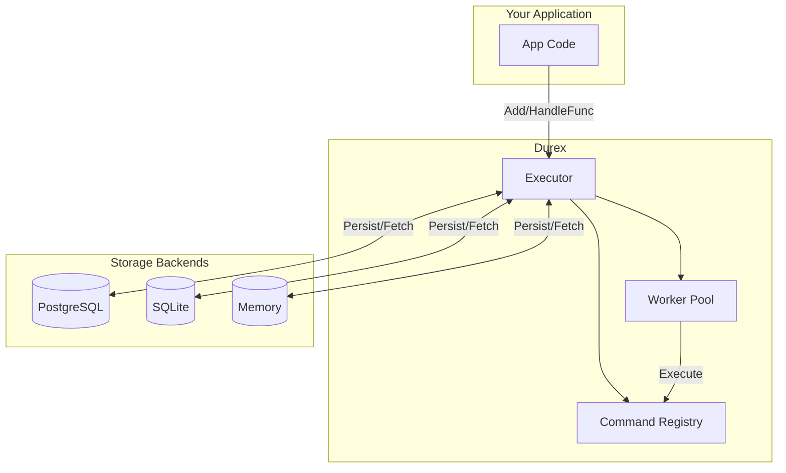
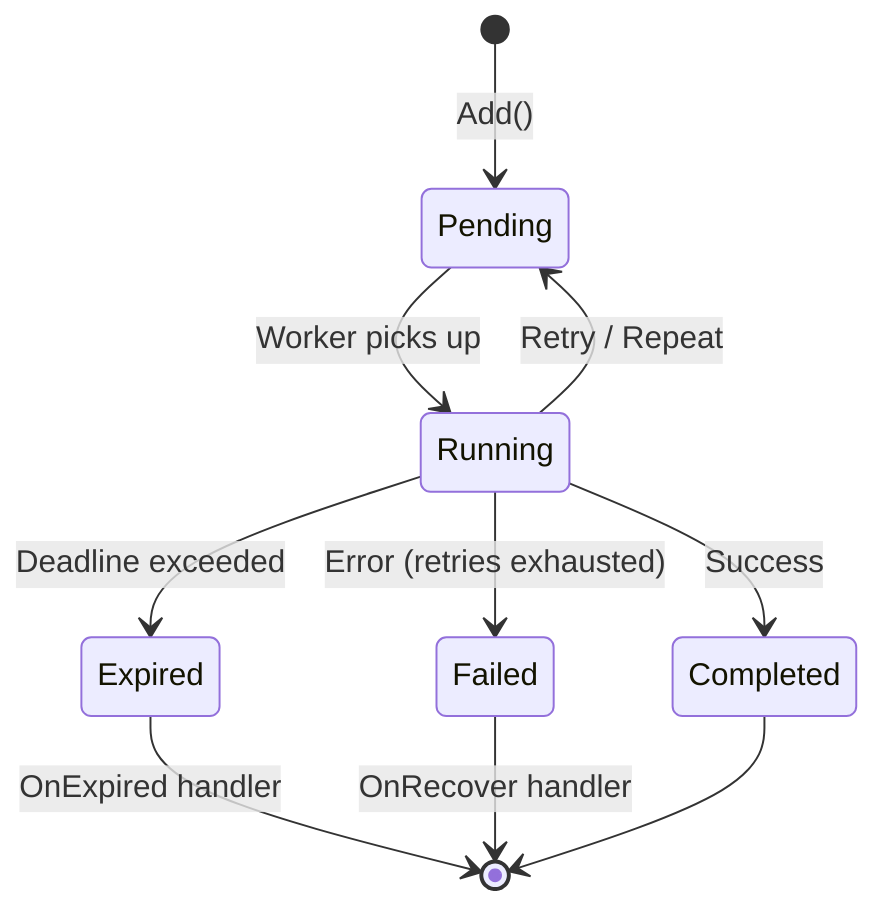
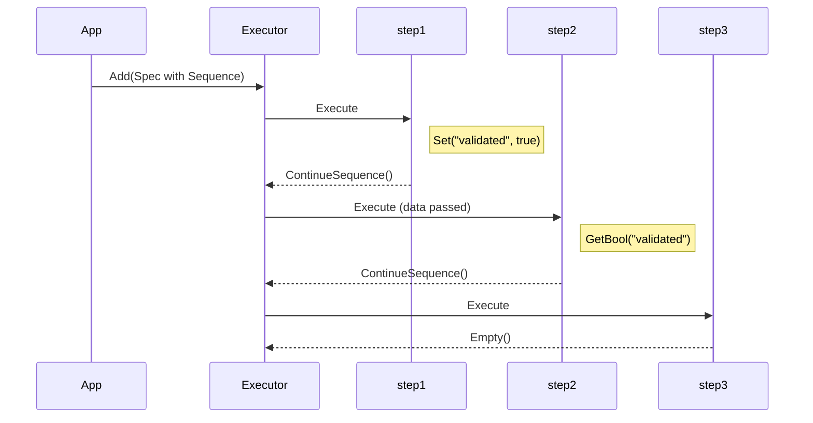
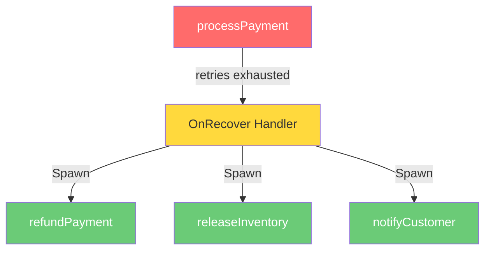

# Durex

[](https://pkg.go.dev/github.com/simonovic86/durex)
[](https://goreportcard.com/report/github.com/simonovic86/durex)
[](https://opensource.org/licenses/MIT)

**Durable Execution Framework for Go**

Durex enables you to build reliable, persistent command/task execution systems with automatic retries, deadlines, and recovery from failures.

## Features

- 🔄 **Persistent Commands** - Commands survive process restarts
- 🔁 **Automatic Retries** - Configurable retry logic with backoff strategies
- ⏰ **Deadlines** - Time-bound execution with expiration handlers
- 🔗 **Workflows** - Chain commands together with sequences
- 🛡️ **Recovery** - Custom error handling and compensation (saga pattern)
- 🎯 **Type Safety** - Generic typed commands with `HandleTyped[T]`
- 💾 **Multiple Backends** - PostgreSQL, SQLite, In-Memory
- 🚦 **Rate Limiting** - Control concurrent execution per command type
- 🔑 **Deduplication** - Prevent duplicate commands with unique keys
- 🔍 **Tracing** - Trace and correlation IDs across command chains
- 🔒 **Multi-Instance Safe** - Row-level locking for horizontal scaling
- 📊 **Web Dashboard** - Built-in real-time monitoring UI
- ⏱️ **Execution Timeouts** - Per-command timeout with context cancellation
- 🛡️ **Panic Recovery** - Workers survive panics and mark commands as failed
- 🔧 **Stuck Command Recovery** - Automatic detection and recovery of stuck commands
- 📬 **Dead Letter Queue** - Failed commands moved to DLQ for inspection and replay
- ❌ **Command Cancellation** - Cancel pending commands by ID or tag
- 🏥 **Health Endpoint** - `/api/health` for load balancer health checks

## Architecture



## Installation

```bash
go get github.com/simonovic86/durex
```

## Quick Start

```go
package main

import (
    "context"
    "github.com/simonovic86/durex"
    "github.com/simonovic86/durex/storage"
)

func main() {
    // Create executor
    executor := durex.New(storage.NewMemory())

    // Register a command - just a function!
    executor.HandleFunc("greet", func(ctx context.Context, cmd *durex.Instance) (durex.Result, error) {
        name := cmd.GetString("name")
        fmt.Printf("Hello, %s!\n", name)
        return durex.Empty(), nil
    })

    // Start processing
    executor.Start(context.Background())
    defer executor.Stop()

    // Add a command
    executor.Add(ctx, durex.Spec{
        Name: "greet",
        Data: durex.M{"name": "World"},
    })
}
```

## Three Ways to Create Commands

### 1. Simple Function (Recommended)

```go
// Basic - just a function
executor.HandleFunc("sendEmail", func(ctx context.Context, cmd *durex.Instance) (durex.Result, error) {
    to := cmd.GetString("to")
    return mailer.Send(to), nil
})

// With options
executor.HandleFunc("sendEmail", sendEmailFn,
    durex.Retries(3),
    durex.OnRecover(handleFailure),
    durex.OnExpired(handleTimeout),
)
```

### 2. Typed Function (Type-Safe Data)

```go
type EmailData struct {
    To      string `json:"to"`
    Subject string `json:"subject"`
}

// No more GetString() - data is typed!
durex.HandleTyped(executor, "sendEmail", func(ctx context.Context, data EmailData, cmd *durex.Instance) (durex.Result, error) {
    return mailer.Send(data.To, data.Subject), nil
}, durex.WithRetries[EmailData](3))

// Add with typed data
executor.Add(ctx, durex.Typed("sendEmail", EmailData{
    To:      "user@example.com",
    Subject: "Welcome!",
}))
```

### 3. Struct (When You Need Dependencies)

```go
type SendEmailCommand struct {
    durex.BaseCommand
    mailer *MailService
}

func (c *SendEmailCommand) Name() string { return "sendEmail" }

func (c *SendEmailCommand) Execute(ctx context.Context, cmd *durex.Instance) (durex.Result, error) {
    return c.mailer.Send(cmd.GetString("to")), nil
}

executor.Register(&SendEmailCommand{mailer: mailerService})
```

## Command Results

| Result | Description |
|--------|-------------|
| `durex.Empty()` | Done, no follow-up |
| `durex.Repeat()` | Run again after Period |
| `durex.Retry()` | Retry immediately |
| `durex.Next(spec)` | Spawn one command |
| `durex.Spawn(specs...)` | Spawn multiple commands |

### Command Lifecycle



## Workflows (Command Chaining)



```go
// Register steps
executor.HandleFunc("step1", func(ctx context.Context, cmd *durex.Instance) (durex.Result, error) {
    cmd.Set("validated", true)  // Pass data to next step
    return cmd.ContinueSequence(nil), nil
})

executor.HandleFunc("step2", func(ctx context.Context, cmd *durex.Instance) (durex.Result, error) {
    validated := cmd.GetBool("validated")  // Receive data from previous step
    return cmd.ContinueSequence(nil), nil
})

// Execute workflow: step1 → step2 → step3
executor.Add(ctx, durex.Spec{
    Name:     "step1",
    Sequence: []string{"step2", "step3"},
    Data:     durex.M{"orderId": "123"},
})
```

## Repeating Commands (Cron-like)

```go
executor.HandleFunc("cleanup", func(ctx context.Context, cmd *durex.Instance) (durex.Result, error) {
    // cleanup logic...
    return durex.Repeat(), nil  // Run again after period
}, durex.Period(time.Hour))
```

## Error Recovery (Saga Pattern)



```go
executor.HandleFunc("processPayment", processPayment,
    durex.Retries(3),
    durex.OnRecover(func(ctx context.Context, cmd *durex.Instance, err error) (durex.Result, error) {
        // Payment failed - spawn compensation commands
        return durex.Spawn(
            durex.Spec{Name: "refundPayment", Data: cmd.Data},
            durex.Spec{Name: "releaseInventory", Data: cmd.Data},
            durex.Spec{Name: "notifyCustomer", Data: durex.M{"error": err.Error()}},
        ), nil
    }),
)
```

## Delayed Execution

```go
executor.Add(ctx, durex.Spec{
    Name:  "sendReminder",
    Delay: 24 * time.Hour,  // Run tomorrow
    Data:  durex.M{"userId": "123"},
})
```

## Deadlines

```go
executor.HandleFunc("timeoutTask", taskFn,
    durex.Deadline(5*time.Minute),
    durex.OnExpired(func(ctx context.Context, cmd *durex.Instance) (durex.Result, error) {
        log.Println("Task timed out!")
        return durex.Empty(), nil
    }),
)
```

## Execution Timeouts

Limit how long each command execution can take. Unlike deadlines (which prevent starting after a time), timeouts cancel long-running executions:

```go
// Per-command timeout
executor.Add(ctx, durex.Spec{
    Name:    "slowTask",
    Timeout: 30 * time.Second,  // Cancel if takes longer than 30s
})

// Default timeout for all commands
executor := durex.New(store,
    durex.WithDefaultTimeout(time.Minute),
)

// Command-level override
executor.Add(ctx, durex.Spec{
    Name:    "quickTask",
    Timeout: 5 * time.Second,  // Override default
})
```

When a timeout occurs:
- The context passed to your handler is cancelled
- The command is marked as failed
- Retries are attempted if configured
- Your handler should check `ctx.Done()` for graceful cancellation

## Storage Backends

```go
// In-memory (development/testing)
store := storage.NewMemory()

// SQLite (single instance)
store, _ := storage.OpenSQLite("commands.db")
store.Migrate(ctx)

// PostgreSQL (production)
db, _ := sql.Open("postgres", "postgres://...")
store := storage.NewPostgres(db)
store.Migrate(ctx)
```

## Configuration

```go
executor := durex.New(store,
    durex.WithParallelism(8),              // Worker count
    durex.WithDefaultRetries(3),           // Default retries
    durex.WithDefaultTimeout(30*time.Second), // Default execution timeout
    durex.WithCleanupInterval(time.Hour),  // Auto-cleanup
    durex.WithGracefulShutdown(30*time.Second),
    durex.WithDashboard(":8080"),          // Enable web dashboard
    durex.WithDeadLetterQueue(),           // Enable DLQ for failed commands
    durex.WithMiddleware(loggingMiddleware),
    durex.WithBackoff(durex.DefaultExponentialBackoff()), // Retry backoff
    durex.WithRateLimit("sendEmail", 10),  // Max 10 concurrent emails
    durex.WithGlobalRateLimit(100),        // Max 100 total concurrent
    durex.WithStuckCommandRecovery(time.Minute, 5*time.Minute), // Recover stuck commands
)
```

## Backoff Strategies

Control retry timing with configurable backoff:

```go
// Exponential backoff with jitter (recommended for production)
executor := durex.New(store,
    durex.WithBackoff(durex.DefaultExponentialBackoff()),
)

// Custom exponential: 1s → 2s → 4s → 8s... (max 5 min)
executor := durex.New(store,
    durex.WithBackoff(durex.ExponentialBackoff{
        InitialDelay: time.Second,
        MaxDelay:     5 * time.Minute,
        Multiplier:   2.0,
    }),
)

// Add jitter to prevent thundering herd
executor := durex.New(store,
    durex.WithBackoff(durex.JitteredBackoff{
        Strategy:   durex.ExponentialBackoff{InitialDelay: time.Second},
        JitterRate: 0.1, // ±10% randomness
    }),
)
```

Available strategies:
- `NoBackoff()` - Immediate retry (default)
- `ConstantBackoff{Delay: 5*time.Second}` - Fixed delay
- `LinearBackoff{InitialDelay: time.Second, MaxDelay: time.Minute}` - Linear increase
- `ExponentialBackoff{...}` - Exponential increase
- `JitteredBackoff{...}` - Wrap any strategy with randomness

## Rate Limiting

Control concurrent command execution to prevent overwhelming external services:

```go
executor := durex.New(store,
    durex.WithRateLimit("sendEmail", 10),    // Max 10 concurrent emails
    durex.WithRateLimit("apiCall", 5),       // Max 5 concurrent API calls
    durex.WithGlobalRateLimit(100),          // Max 100 total concurrent
)
```

Commands will wait for a slot to become available before executing.

## Deduplication (Unique Keys)

Prevent duplicate commands from running simultaneously:

```go
// Only one active "welcome email to user123" can exist
executor.Add(ctx, durex.Spec{
    Name:      "sendEmail",
    UniqueKey: "welcome-email:user123",
    Data:      durex.M{"to": "user@example.com"},
})

// Attempting to add another with same key returns ErrDuplicateCommand
_, err := executor.Add(ctx, durex.Spec{
    Name:      "sendEmail",
    UniqueKey: "welcome-email:user123",
})
// err == durex.ErrDuplicateCommand
```

Use unique keys for:
- Preventing duplicate notifications
- Ensuring idempotent operations
- Rate limiting per-entity (e.g., one sync per user)

## Tracing & Correlation

Track related commands across workflows:

```go
// Set trace/correlation IDs on the root command
executor.Add(ctx, durex.Spec{
    Name:          "processOrder",
    TraceID:       "trace-abc123",      // From your tracing system
    CorrelationID: "order-456",         // Links all related commands
    Sequence:      []string{"chargePayment", "shipOrder", "sendConfirmation"},
})

// Access in your command handler
executor.HandleFunc("chargePayment", func(ctx context.Context, cmd *durex.Instance) (durex.Result, error) {
    log.Printf("[%s] Processing payment for correlation: %s", 
        cmd.TraceID, cmd.CorrelationID)
    
    // IDs automatically propagate to child commands
    return cmd.ContinueSequence(nil), nil
})

// Query all commands in a workflow
commands, _ := store.FindByCorrelationID(ctx, "order-456")
```

## Middleware

```go
func loggingMiddleware(ctx durex.MiddlewareContext, next func() (durex.Result, error)) (durex.Result, error) {
    start := time.Now()
    result, err := next()
    slog.Info("Command executed", "name", ctx.Command.Name, "duration", time.Since(start))
    return result, err
}
```

## Web Dashboard

Durex includes a built-in real-time monitoring dashboard with zero external dependencies:

```go
// Recommended: enable via option (auto-starts with executor)
executor := durex.New(store,
    durex.WithDashboard(":8080"),
)

// Or start manually
go executor.ServeDashboard(":8080")

// Or integrate with existing server
http.Handle("/durex/", http.StripPrefix("/durex", executor.DashboardHandler()))
```

The dashboard shows:
- Live command counts (pending, completed, failed)
- Rate limit utilization
- Recent commands table with status, attempts, timing
- Auto-refreshes every 2 seconds

## Multi-Instance Deployment

For horizontal scaling, use PostgreSQL with row-level locking. Durex automatically detects `LockingStorage` and uses `FOR UPDATE SKIP LOCKED` to prevent multiple instances from claiming the same command:

```go
// PostgreSQL storage automatically enables locking mode
db, _ := sql.Open("postgres", "postgres://...")
store := storage.NewPostgres(db)
store.Migrate(ctx)

executor := durex.New(store,
    durex.WithParallelism(8),
    durex.WithPollInterval(500*time.Millisecond),  // How often to poll for work
    durex.WithClaimBatchSize(20),                   // Commands claimed per poll
)
```

This enables safe deployment of multiple executor instances behind a load balancer.

## Reliability Features

### Panic Recovery

Durex automatically recovers from panics in command handlers. Workers continue processing other commands:

```go
executor.HandleFunc("riskyTask", func(ctx context.Context, cmd *durex.Instance) (durex.Result, error) {
    panic("something went wrong")  // Worker survives this!
})
```

When a panic occurs:
- The panic is logged with command details
- The command is marked as `FAILED` with the panic message
- The error handler is called (if configured)
- Workers continue processing other commands

### Stuck Command Recovery

Commands can get stuck in `STARTED` status if a worker crashes or the process restarts. Enable automatic recovery:

```go
executor := durex.New(store,
    durex.WithStuckCommandRecovery(
        time.Minute,      // Check every minute
        5*time.Minute,    // Commands stuck >5 min are recovered
    ),
)
```

Recovered commands are reset to `PENDING` and re-executed.

### Error Handling

Global error handler for all command failures:

```go
executor := durex.New(store,
    durex.WithErrorHandler(func(cmd *durex.Instance, err error) {
        slog.Error("Command failed",
            "id", cmd.ID,
            "name", cmd.Name,
            "error", err,
        )
        // Send to error tracking service, etc.
    }),
)
```

### Dead Letter Queue

Enable DLQ to preserve failed commands for inspection and replay:

```go
executor := durex.New(store,
    durex.WithDeadLetterQueue(),
)

// Later, inspect failed commands
deadLettered, _ := executor.FindDeadLettered(ctx)

// Replay a specific command
executor.ReplayFromDLQ(ctx, "cmd_abc123")

// Purge old dead-lettered commands
purged, _ := executor.PurgeDLQ(ctx, 7*24*time.Hour) // Older than 7 days
```

### Command Cancellation

Cancel pending commands programmatically:

```go
// Cancel a specific command
executor.Cancel(ctx, "cmd_abc123")

// Cancel all commands with a tag (requires QueryableStorage)
cancelled, _ := executor.CancelByTag(ctx, "batch-123")
```

### Health Endpoint

The dashboard includes a health endpoint for load balancers:

```
GET /api/health

{
  "status": "healthy",
  "started": true,
  "storage_ok": true,
  "worker_count": 4,
  "queue_depth": 0,
  "timestamp": "2024-01-15T10:30:00Z"
}
```

Status values: `healthy`, `degraded` (shutting down), `unhealthy` (not started or storage error).

## Examples

See [examples/basic](./examples/basic) and [examples/workflow](./examples/workflow) for complete working examples.

```bash
# Run basic example
go run ./examples/basic

# Run e-commerce workflow example  
go run ./examples/workflow
```

## Documentation

- **[Workflows & Chaining Guide](./docs/WORKFLOWS.md)** - Deep dive into command chaining, sequences, fan-out/fan-in, saga pattern, and best practices

## License

MIT License - see [LICENSE](LICENSE)
